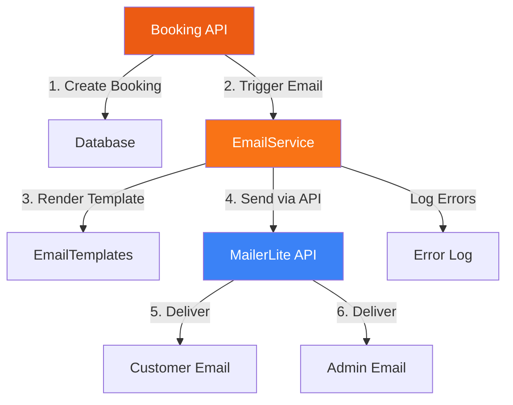

# Design Document: MailerLite Email Integration

## Overview

This design specifies the integration of MailerLite's transactional email API into the CSN Explore booking system. The solution adds automated email notifications for booking confirmations (sent to customers) and booking alerts (sent to administrators) without disrupting the existing booking flow.

### Key Design Principles

1. **Non-blocking Architecture**: Email failures must never prevent booking creation
2. **Separation of Concerns**: Email logic is isolated in a dedicated service module
3. **Security First**: API credentials stored securely using environment variables
4. **Mobile-First Templates**: Email templates optimized for mobile devices with responsive HTML
5. **Brand Consistency**: Templates match CSN Explore's visual identity (primary color: #ec5b13)

### Technology Stack

- **Email Service Provider**: MailerLite JSON API (https://connect.mailerlite.com/api)
- **HTTP Client**: PHP cURL for API requests
- **Template Engine**: PHP with inline CSS (for email client compatibility)
- **Configuration**: Environment variables via `.env` file
- **Error Logging**: PHP error_log to `logs/email_errors.log`

## Architecture

### System Components



### Component Responsibilities

| Component | Responsibility | Location |
|-----------|---------------|----------|
| **BookingAPI** | Creates booking records, triggers email service | `php/api/bookings.php` |
| **EmailService** | Orchestrates email sending, handles errors | `php/services/EmailService.php` |
| **MailerLiteClient** | Wraps MailerLite API communication | `php/services/MailerLiteClient.php` |
| **EmailTemplates** | Renders HTML email templates | `php/templates/emails/` |
| **ConfigLoader** | Loads environment variables securely | `php/config.php` (extended) |

### Data Flow

1. **Booking Creation**: User submits booking form → API validates and inserts into database with status='pending'
2. **Email Trigger**: Immediately after successful insert (while booking is still in pending status), API calls `EmailService::sendBookingEmails($bookingId)`
3. **Template Rendering**: EmailService loads booking data and renders both templates
4. **API Communication**: MailerLiteClient sends requests to MailerLite API
5. **Error Handling**: Any failures are logged; booking remains successful
6. **Delivery**: MailerLite delivers emails to recipients

## Components and Interfaces

### 1. EmailService Class

**Purpose**: Central service for all email operations

**Interface**:
```php
class EmailService {
    /**
     * Send both user confirmation and admin notification emails
     * @param int $bookingId The booking record ID
     * @return array ['user_sent' => bool, 'admin_sent' => bool, 'errors' => array]
     */
    public static function sendBookingEmails(int $bookingId): array;
    
    /**
     * Send user confirmation email
     * @param array $booking Booking record data
     * @return bool Success status
     */
    private static function sendUserConfirmation(array $booking): bool;
    
    /**
     * Send admin notification email
     * @param array $booking Booking record data
     * @return bool Success status
     */
    private static function sendAdminNotification(array $booking): bool;
    
    /**
     * Log email errors
     * @param string $message Error message
     * @param array $context Additional context
     */
    private static function logError(string $message, array $context = []): void;
}
```

**Dependencies**:
- `MailerLiteClient` for API communication
- `Database` for fetching booking records
- Email template files for rendering

### 2. MailerLiteClient Class

**Purpose**: Wrapper for MailerLite JSON API transactional email endpoint

**Interface**:
```php
class MailerLiteClient {
    private string $apiKey;
    private string $apiUrl = 'https://connect.mailerlite.com/api';
    private int $timeout = 10;
    
    public function __construct(string $apiKey);
    
    /**
     * Send transactional email via MailerLite
     * @param string $to Recipient email address
     * @param string $subject Email subject line
     * @param string $htmlContent HTML email body
     * @param string $fromEmail Sender email (default: noreply@csnexplore.com)
     * @param string $fromName Sender name (default: CSN Explore)
     * @return array ['success' => bool, 'message' => string, 'response' => array]
     */
    public function sendEmail(
        string $to,
        string $subject,
        string $htmlContent,
        string $fromEmail = 'noreply@csnexplore.com',
        string $fromName = 'CSN Explore'
    ): array;
    
    /**
     * Validate email address format
     * @param string $email Email to validate
     * @return bool
     */
    private function isValidEmail(string $email): bool;
    
    /**
     * Make HTTP request to MailerLite API
     * @param string $endpoint API endpoint path
     * @param array $data Request payload
     * @return array Response data
     */
    private function makeRequest(string $endpoint, array $data): array;
}
```

**API Base URL**: `https://connect.mailerlite.com/api`

**Required Headers**:
```
Content-Type: application/json
Accept: application/json
Authorization: Bearer {API_KEY}
```

**Request Format**:
```json
{
  "to": [{"email": "customer@example.com"}],
  "subject": "Booking Confirmation - CSN Explore",
  "from": {"email": "noreply@csnexplore.com", "name": "CSN Explore"},
  "html": "<html>...</html>"
}
```

**Authentication**: Bearer token in `Authorization` header

### 3. Email Templates

**User Confirmation Template** (`php/templates/emails/user-confirmation.php`)

**Variables**:
- `$booking` - Full booking record array
- `$customer_name` - Customer's first name
- `$booking_id` - Booking reference number
- `$service_type` - Type of service booked
- `$booking_date` - Date of booking
- `$number_of_people` - Party size

**Admin Notification Template** (`php/templates/emails/admin-notification.php`)

**Variables**:
- `$booking` - Full booking record array
- `$formatted_date` - Human-readable creation timestamp

### 4. Configuration Extension

**Environment Variables** (`.env` file):
```env
MAILERLITE_API_KEY=your_api_key_here
MAILERLITE_FROM_EMAIL=noreply@csnexplore.com
MAILERLITE_FROM_NAME=CSN Explore
ADMIN_NOTIFICATION_EMAIL=supportcsnexplore@gmail.com
```

**Config Loader** (extend `php/config.php`):
```php
// Load .env file if exists
if (file_exists(__DIR__ . '/../.env')) {
    $lines = file(__DIR__ . '/../.env', FILE_IGNORE_NEW_LINES | FILE_SKIP_EMPTY_LINES);
    foreach ($lines as $line) {
        if (strpos(trim($line), '#') === 0) continue;
        list($key, $value) = explode('=', $line, 2);
        putenv(trim($key) . '=' . trim($value));
    }
}

define('MAILERLITE_API_KEY', getenv('MAILERLITE_API_KEY') ?: '');
define('MAILERLITE_FROM_EMAIL', getenv('MAILERLITE_FROM_EMAIL') ?: 'noreply@csnexplore.com');
define('MAILERLITE_FROM_NAME', getenv('MAILERLITE_FROM_NAME') ?: 'CSN Explore');
define('ADMIN_NOTIFICATION_EMAIL', getenv('ADMIN_NOTIFICATION_EMAIL') ?: 'supportcsnexplore@gmail.com');
```

## Data Models

### Booking Record Structure

The existing `bookings` table schema (no changes required):

```sql
CREATE TABLE bookings (
    id INTEGER PRIMARY KEY AUTOINCREMENT,
    full_name TEXT NOT NULL,
    phone TEXT NOT NULL,
    email TEXT,
    booking_date TEXT,
    checkin_date TEXT,
    checkout_date TEXT,
    number_of_people INTEGER DEFAULT 1,
    service_type TEXT,
    listing_id INTEGER,
    listing_name TEXT,
    status TEXT DEFAULT 'pending',
    notes TEXT,
    created_at DATETIME DEFAULT CURRENT_TIMESTAMP,
    updated_at DATETIME DEFAULT CURRENT_TIMESTAMP
);
```

### Email Payload Structure

**MailerLite API Request**:
```php
[
    'to' => 'customer@example.com',
    'subject' => 'Booking Confirmation - CSN Explore',
    'from' => 'noreply@csnexplore.com',
    'from_name' => 'CSN Explore',
    'html' => '<html>...</html>'
]
```

### Email Service Response Structure

```php
[
    'user_sent' => true,      // Whether user email was sent successfully
    'admin_sent' => true,     // Whether admin email was sent successfully
    'errors' => []            // Array of error messages if any
]
```

## Correctness Properties

*A property is a characteristic or behavior that should hold true across all valid executions of a system—essentially, a formal statement about what the system should do. Properties serve as the bridge between human-readable specifications and machine-verifiable correctness guarantees.*


### Property 1: Email Service Triggered for All New Bookings

*For any* successfully created booking record (regardless of status - pending, completed, or cancelled), the email service should be triggered immediately to send both user confirmation and admin notification emails.

**Validates: Requirements 2.1, 3.1**

**Note**: Bookings are created with status='pending' by default. Emails are sent at creation time, not when status changes to 'completed'.

### Property 2: User Email Recipient Correctness

*For any* user confirmation email, the recipient address should match the email field from the corresponding booking record.

**Validates: Requirements 2.2**

### Property 3: User Email Content Completeness

*For any* user confirmation email, the rendered HTML should contain: customer's full name, booking reference number, service type, number of people, the "processed within 4 hours" message, the "confirmation after admin approval" message, and contact information (phone: +91 86009 68888, email: supportcsnexplore@gmail.com). If booking_date is present in the record, it should also be included in the email.

**Validates: Requirements 2.3, 2.4, 2.5, 2.6, 2.7, 2.8, 2.9, 2.10**

### Property 4: Admin Email Recipient Correctness

*For any* admin notification email, the recipient address should be supportcsnexplore@gmail.com.

**Validates: Requirements 3.2**

### Property 5: Admin Email Content Completeness

*For any* admin notification email, the rendered HTML should contain all fields from the booking record including: full_name, phone, email, booking_date, checkin_date, checkout_date, number_of_people, service_type, listing_id, listing_name, notes, and created_at timestamp.

**Validates: Requirements 3.3**

### Property 6: Email Failures Don't Break Bookings

*For any* booking creation attempt, if the email service fails to send emails (due to API errors, network issues, or any other reason), the booking record should still be successfully created and persisted in the database.

**Validates: Requirements 5.1, 5.2**

### Property 7: Email Failures Are Logged

*For any* email sending failure, the error should be logged with the booking ID and specific error details (error message, timestamp, email type).

**Validates: Requirements 5.3**

### Property 8: Email Address Validation

*For any* email address before sending, the email service should validate the format using standard email validation rules, and reject invalid addresses without attempting to send.

**Validates: Requirements 5.6**

### Property 9: Dynamic Content Sanitization

*For any* user-provided data from the booking record (full_name, notes, listing_name, etc.), the content should be sanitized and HTML special characters escaped before being inserted into the email template.

**Validates: Requirements 6.1, 6.2**

### Property 10: Missing Optional Data Handled Gracefully

*For any* booking record with missing or null optional fields (booking_date, checkin_date, checkout_date, listing_name, notes), the email rendering should handle these gracefully by either using default values or omitting those sections without causing errors.

**Validates: Requirements 6.3, 6.4**

### Property 11: Complete Booking Data Passed to Email Service

*For any* booking creation, the complete booking record data (all fields from the database row) should be passed to the email service without any data loss or transformation.

**Validates: Requirements 7.2**

### Property 12: API Response Structure Unchanged

*For any* booking API request, the response structure and format should remain identical regardless of whether email sending succeeds or fails.

**Validates: Requirements 7.4**

### Property 13: Branding Elements Present

*For any* email template (user or admin), the rendered HTML should contain the CSN Explore logo image reference and the primary brand color #ec5b13 in the styling.

**Validates: Requirements 4.2**

## Error Handling

### Error Categories and Responses

| Error Type | Handling Strategy | User Impact | Logging |
|------------|------------------|-------------|---------|
| **Missing API Key** | Log error, skip email sending | None - booking succeeds | ERROR: "MailerLite API key not configured" |
| **Invalid API Key** | Log error, return failure status | None - booking succeeds | ERROR: "MailerLite authentication failed" |
| **API Timeout** | Abort request after 10s, log error | None - booking succeeds | ERROR: "MailerLite API timeout after 10s" |
| **API Rate Limit** | Log error, return failure status | None - booking succeeds | WARNING: "MailerLite rate limit exceeded" |
| **Network Error** | Log error, return failure status | None - booking succeeds | ERROR: "Network error: {details}" |
| **Invalid Email** | Skip sending, log warning | None - booking succeeds | WARNING: "Invalid email address: {email}" |
| **Missing Email** | Skip user email, send admin email | User doesn't receive confirmation | INFO: "No email provided for booking {id}" |
| **Template Error** | Log error, return failure status | None - booking succeeds | ERROR: "Template rendering failed: {details}" |
| **Malformed Response** | Log error, return failure status | None - booking succeeds | ERROR: "Invalid API response: {details}" |

### Error Logging Format

All email errors are logged to `logs/email_errors.log` with the following format:

```
[2025-01-15 14:32:10] ERROR: Failed to send user confirmation email
Booking ID: 123
Email: customer@example.com
Error: cURL error 28: Timeout was reached
Context: {"service_type":"stays","listing_name":"Hotel Example"}
```

### Retry Strategy

**No automatic retries** - Email sending is attempted once per booking creation. Rationale:
- Booking confirmations are time-sensitive
- Failed emails can be manually resent by admins if needed
- Retries could cause duplicate emails if the first attempt actually succeeded
- Keeps the system simple and predictable

### Graceful Degradation

1. **Missing User Email**: Admin email still sent, booking succeeds
2. **User Email Fails**: Admin email still attempted, booking succeeds
3. **Admin Email Fails**: Logged for manual follow-up, booking succeeds
4. **Both Emails Fail**: Logged for manual follow-up, booking succeeds

## Testing Strategy

### Dual Testing Approach

This feature requires both unit tests and property-based tests for comprehensive coverage:

**Unit Tests** focus on:
- Specific examples of email rendering with known data
- Edge cases (missing email, null fields, special characters)
- Error conditions (invalid API key, network timeout, malformed responses)
- Integration points (booking API calling email service)

**Property-Based Tests** focus on:
- Universal properties that hold for all bookings
- Content validation across randomized booking data
- Sanitization effectiveness with generated malicious inputs
- Error handling consistency across various failure scenarios

### Property-Based Testing Configuration

**Library**: PHPUnit with `eris/eris` for property-based testing

**Configuration**:
- Minimum 100 iterations per property test
- Each test tagged with feature name and property reference
- Tag format: `@group mailerlite-booking-email-integration @property {number}`

### Test Coverage Requirements

| Component | Unit Test Coverage | Property Test Coverage |
|-----------|-------------------|----------------------|
| EmailService | 90%+ | All 13 properties |
| MailerLiteClient | 85%+ | Properties 6, 7, 8 |
| Email Templates | 80%+ | Properties 3, 5, 9, 10, 13 |
| Booking API Integration | 90%+ | Properties 1, 6, 11, 12 |

### Example Test Cases

**Unit Test Example**:
```php
public function testUserConfirmationEmailWithCompleteData() {
    $booking = [
        'id' => 123,
        'full_name' => 'John Doe',
        'email' => 'john@example.com',
        'phone' => '+91 9876543210',
        'service_type' => 'stays',
        'booking_date' => '2025-02-15',
        'number_of_people' => 2,
        'listing_name' => 'Hotel Paradise'
    ];
    
    $html = EmailTemplates::renderUserConfirmation($booking);
    
    $this->assertStringContainsString('John Doe', $html);
    $this->assertStringContainsString('Booking #123', $html);
    $this->assertStringContainsString('stays', $html);
    $this->assertStringContainsString('processed within 4 hours', $html);
    $this->assertStringContainsString('+91 86009 68888', $html);
}
```

**Property Test Example**:
```php
/**
 * @group mailerlite-booking-email-integration
 * @property 9: Dynamic content sanitization
 */
public function testDynamicContentIsSanitized() {
    $this->forAll(
        Generator\string(),
        Generator\string()
    )->then(function ($name, $notes) {
        $booking = [
            'id' => 1,
            'full_name' => $name,
            'notes' => $notes,
            'email' => 'test@example.com'
        ];
        
        $html = EmailTemplates::renderUserConfirmation($booking);
        
        // Verify no unescaped HTML tags from user input
        $this->assertStringNotContainsString('<script', $html);
        $this->assertStringNotContainsString('javascript:', $html);
        
        // Verify special characters are escaped
        if (strpos($name, '<') !== false) {
            $this->assertStringContainsString('&lt;', $html);
        }
    });
}
```

### Integration Testing

**Manual Testing Checklist**:
- [ ] Create booking with valid email → verify both emails received
- [ ] Create booking without email → verify only admin email received
- [ ] Create booking with invalid API key → verify booking succeeds, error logged
- [ ] Test email rendering in Gmail, Outlook, Apple Mail
- [ ] Verify mobile responsiveness on actual devices
- [ ] Test with special characters in names and notes
- [ ] Verify branding colors and logo display correctly
- [ ] Test with missing optional fields (dates, listing name)

**API Testing**:
- Use MailerLite sandbox/test mode during development
- Verify API request format matches MailerLite documentation
- Test rate limiting behavior
- Verify timeout handling (simulate slow network)

## Email Template Design Specifications

### User Confirmation Email

**Subject Line**: `Booking Confirmation - CSN Explore`

**Visual Structure**:
```
┌─────────────────────────────────────┐
│  [CSN Explore Logo]                 │
├─────────────────────────────────────┤
│  Hi [Customer Name],                │
│                                     │
│  Thank you for your booking!        │
│                                     │
│  ┌───────────────────────────────┐ │
│  │ Booking Reference: #[ID]      │ │
│  │ Service: [Type]               │ │
│  │ Date: [Booking Date]          │ │
│  │ People: [Number]              │ │
│  └───────────────────────────────┘ │
│                                     │
│  Your booking will be processed    │
│  within 4 hours. You'll receive    │
│  a confirmation email after admin  │
│  approval.                         │
│                                     │
│  ┌───────────────────────────────┐ │
│  │ Need Help?                    │ │
│  │ Phone: +91 86009 68888        │ │
│  │ Email: supportcsnexplore@...  │ │
│  └───────────────────────────────┘ │
│                                     │
│  © 2025 CSN Explore                │
└─────────────────────────────────────┘
```

**Color Scheme**:
- Primary: `#ec5b13` (headers, buttons, accents)
- Background: `#ffffff`
- Text: `#1f2937` (dark gray)
- Secondary text: `#6b7280` (medium gray)
- Borders: `#e5e7eb` (light gray)

**Typography**:
- Headings: `Arial, Helvetica, sans-serif` - 24px, bold
- Body: `Arial, Helvetica, sans-serif` - 16px, regular
- Small text: `Arial, Helvetica, sans-serif` - 14px, regular

**Mobile Responsiveness**:
- Max width: 600px
- Fluid layout: 100% width on mobile
- Font sizes: Minimum 14px for readability
- Touch-friendly buttons: Minimum 44px height
- Padding: 20px on mobile, 40px on desktop

### Admin Notification Email

**Subject Line**: `New Booking #[ID] - [Service Type]`

**Visual Structure**:
```
┌─────────────────────────────────────┐
│  NEW BOOKING ALERT                  │
├─────────────────────────────────────┤
│  Booking #[ID]                      │
│  Created: [Timestamp]               │
│                                     │
│  CUSTOMER DETAILS                   │
│  Name: [Full Name]                  │
│  Phone: [Phone]                     │
│  Email: [Email]                     │
│                                     │
│  BOOKING DETAILS                    │
│  Service: [Type]                    │
│  Listing: [Name]                    │
│  Date: [Booking Date]               │
│  Check-in: [Date]                   │
│  Check-out: [Date]                  │
│  People: [Number]                   │
│                                     │
│  NOTES                              │
│  [Customer Notes]                   │
│                                     │
│  [View in Admin Panel Button]      │
└─────────────────────────────────────┘
```

**Design Characteristics**:
- Information-dense layout for quick scanning
- Clear section headers in bold
- Monospace font for IDs and timestamps
- Prominent CTA button to admin panel
- All data fields displayed (even if empty)

### HTML Email Best Practices

**Inline CSS**: All styles must be inline for email client compatibility
```html
<td style="padding: 20px; background-color: #ffffff; border-radius: 8px;">
```

**Table-Based Layout**: Use tables for structure (not divs)
```html
<table width="100%" cellpadding="0" cellspacing="0" border="0">
  <tr>
    <td>Content here</td>
  </tr>
</table>
```

**Image Handling**:
- Use absolute URLs for images
- Include alt text for accessibility
- Set explicit width and height
- Provide fallback background colors

**Email Client Compatibility**:
- Avoid CSS Grid and Flexbox
- Use `<table>` for layout
- Inline all CSS
- Test in Litmus or Email on Acid
- Support Outlook, Gmail, Apple Mail, Yahoo Mail

## Security Considerations

### API Key Protection

**Storage**:
- Store in `.env` file (never commit to version control)
- Add `.env` to `.gitignore`
- Use environment variables in production
- Restrict file permissions: `chmod 600 .env`

**Access Control**:
- Only `EmailService` and `MailerLiteClient` access the API key
- No API key exposure in logs or error messages
- No API key in client-side code or responses

### Input Sanitization

**User-Provided Data**:
- Sanitize all booking record fields before email rendering
- Use `htmlspecialchars()` with `ENT_QUOTES` flag
- Validate email addresses with `filter_var(FILTER_VALIDATE_EMAIL)`
- Strip HTML tags from text fields
- Limit field lengths to prevent buffer issues

**XSS Prevention**:
```php
function sanitizeForEmail($value) {
    return htmlspecialchars(
        strip_tags(trim((string)$value)),
        ENT_QUOTES,
        'UTF-8'
    );
}
```

### Email Injection Prevention

**Header Injection**:
- Validate email addresses strictly
- Reject emails with newlines or special characters
- Use MailerLite API (not PHP mail()) to avoid header injection

**Content Injection**:
- Escape all dynamic content in templates
- Use parameterized template rendering
- Never concatenate raw user input into HTML

### HTTPS/TLS

- All MailerLite API requests over HTTPS
- Verify SSL certificates in cURL requests
- Set `CURLOPT_SSL_VERIFYPEER` to `true`

### Rate Limiting

**Protection Against Abuse**:
- MailerLite enforces API rate limits
- Log rate limit errors for monitoring
- Consider implementing application-level rate limiting if needed
- Monitor for unusual booking patterns

### Data Privacy

**GDPR Compliance**:
- Only send emails to users who provided email addresses
- Include unsubscribe mechanism if sending marketing emails (not required for transactional)
- Store minimal data in email logs
- Respect user privacy preferences

**Email Content**:
- Don't include sensitive payment information
- Don't include passwords or authentication tokens
- Limit personal data to what's necessary

## Implementation Notes

### File Structure

```
php/
├── config.php (extended with email config)
├── services/
│   ├── EmailService.php
│   └── MailerLiteClient.php
├── templates/
│   └── emails/
│       ├── user-confirmation.php
│       └── admin-notification.php
└── api/
    └── bookings.php (modified to call EmailService)

.env (new file, not committed)
logs/
└── email_errors.log (new file)
```

### Integration Steps

1. **Install Dependencies**: None required (using native PHP cURL)
2. **Create .env File**: Add MailerLite API key
3. **Extend Config**: Load environment variables
4. **Create EmailService**: Implement email orchestration logic
5. **Create MailerLiteClient**: Implement API wrapper
6. **Create Templates**: Design and implement HTML email templates
7. **Modify Booking API**: Add email service call after booking creation
8. **Test Integration**: Verify emails send correctly
9. **Deploy**: Update production environment variables

### Deployment Checklist

- [ ] Add `.env` to `.gitignore`
- [ ] Create `.env.example` with placeholder values
- [ ] Set production environment variables
- [ ] Test with MailerLite test mode first
- [ ] Verify email deliverability (check spam folders)
- [ ] Monitor error logs after deployment
- [ ] Test booking flow end-to-end
- [ ] Verify both email types are received
- [ ] Check email rendering in multiple clients
- [ ] Document API key rotation procedure

### Performance Considerations

**Async Execution**:
- Email sending should not block booking API response
- Consider using PHP's `fastcgi_finish_request()` to send response before emails
- Alternative: Queue-based system for high-volume scenarios

**Caching**:
- Cache rendered templates if using template engine
- No caching of booking data (always fresh)

**Monitoring**:
- Track email send success/failure rates
- Monitor API response times
- Alert on high error rates
- Log email delivery statistics

### Maintenance

**API Key Rotation**:
1. Generate new API key in MailerLite dashboard
2. Update `.env` file with new key
3. Test email sending
4. Revoke old API key

**Template Updates**:
- Templates are PHP files, can be updated without code changes
- Test in email clients after updates
- Version control template changes

**Monitoring**:
- Review `logs/email_errors.log` regularly
- Set up alerts for error spikes
- Monitor MailerLite dashboard for delivery rates
- Track bounce rates and spam complaints

## Future Enhancements

**Potential Improvements** (not in current scope):

1. **Email Queue System**: Implement background job processing for emails
2. **Retry Logic**: Add configurable retry attempts for failed emails
3. **Email Templates Admin UI**: Allow admins to edit templates via dashboard
4. **Email Tracking**: Track open rates and click rates
5. **SMS Notifications**: Add SMS alerts via Twilio or similar
6. **Multi-Language Support**: Translate emails based on user preference
7. **Email Preferences**: Allow users to opt-out of certain email types
8. **Rich Notifications**: Add calendar invites, PDF attachments
9. **A/B Testing**: Test different email templates for engagement
10. **Analytics Dashboard**: Visualize email performance metrics

---

**Document Version**: 1.0  
**Last Updated**: 2025-01-15  
**Author**: Kiro AI  
**Status**: Ready for Review
