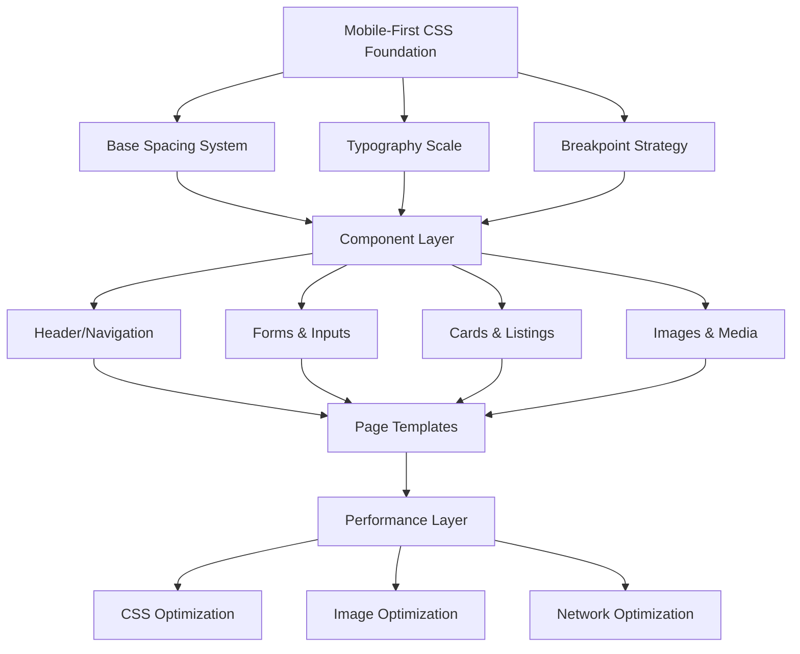

# Design Document: Mobile-First Responsive Optimization

## Overview

This design document outlines a comprehensive mobile-first responsive optimization strategy for the CSNExplore PHP website. The approach focuses on transforming the existing desktop-centric design into a mobile-first architecture that prioritizes touch interactions, performance on slower networks, and optimal viewing experiences across all device sizes. The design implements a systematic spacing system, responsive typography scale, flexible layout patterns, and performance optimizations specifically tailored for mobile devices.

The website currently includes main pages (index.php, listing.php, blogs.php, contact.php, about.php, login.php, register.php), an admin section, 300+ static blog HTML files, and 74+ listing detail HTML files. The optimization will establish a consistent mobile-first CSS architecture that can be applied across all pages while maintaining the existing visual identity and brand elements.

## Architecture

The mobile-responsive optimization follows a layered architecture approach:



## Main Workflow: Mobile-First Rendering

```mermaid
sequenceDiagram
    participant Browser
    participant CSS
    participant Layout
    participant Images
    participant Network
    
    Browser->>CSS: Load mobile-first base styles
    CSS->>Layout: Apply mobile layout (320px+)
    Layout->>Browser: Render mobile view
    
    Browser->>Network: Check viewport width
    Network->>CSS: Load tablet styles (@640px)
    CSS->>Layout: Apply tablet adjustments
    
    Network->>CSS: Load desktop styles (@1024px)
    CSS->>Layout: Apply desktop enhancements
    
    Browser->>Images: Request responsive images
    Images->>Browser: Serve appropriate size
    
    Browser->>Layout: Final render complete


## Components and Interfaces

### Component 1: Spacing System

**Purpose**: Establish a consistent, predictable spacing scale based on 4px/8px increments for mobile-first layouts.

**Interface**:
```css
/* CSS Custom Properties for Spacing */
:root {
  --space-1: 0.25rem;  /* 4px */
  --space-2: 0.5rem;   /* 8px */
  --space-3: 0.75rem;  /* 12px */
  --space-4: 1rem;     /* 16px */
  --space-5: 1.25rem;  /* 20px */
  --space-6: 1.5rem;   /* 24px */
  --space-8: 2rem;     /* 32px */
  --space-10: 2.5rem;  /* 40px */
  --space-12: 3rem;    /* 48px */
  --space-16: 4rem;    /* 64px */
}
```

**Responsibilities**:
- Provide consistent spacing across all components
- Ensure touch-friendly spacing on mobile (minimum 44px tap targets)
- Scale appropriately across breakpoints
- Maintain visual rhythm and hierarchy

### Component 2: Typography Scale

**Purpose**: Define a mobile-optimized typography system with appropriate sizes for readability on small screens.

**Interface**:
```css
/* Mobile-First Typography Scale */
:root {
  /* Font sizes - mobile base */
  --text-xs: 0.75rem;    /* 12px */
  --text-sm: 0.875rem;   /* 14px */
  --text-base: 1rem;     /* 16px */
  --text-lg: 1.125rem;   /* 18px */
  --text-xl: 1.25rem;    /* 20px */
  --text-2xl: 1.5rem;    /* 24px */
  --text-3xl: 1.875rem;  /* 30px */
  --text-4xl: 2.25rem;   /* 36px */
  
  /* Line heights */
  --leading-tight: 1.25;
  --leading-normal: 1.5;
  --leading-relaxed: 1.75;
}

@media (min-width: 640px) {
  :root {
    --text-3xl: 2rem;      /* 32px */
    --text-4xl: 2.5rem;    /* 40px */
  }
}

@media (min-width: 1024px) {
  :root {
    --text-3xl: 2.25rem;   /* 36px */
    --text-4xl: 3rem;      /* 48px */
  }
}
```

**Responsibilities**:
- Ensure minimum 16px body text on mobile (prevents zoom on iOS)
- Scale headings appropriately for mobile screens
- Maintain readability with proper line heights
- Adjust sizes progressively at larger breakpoints


### Component 3: Breakpoint Strategy

**Purpose**: Define standard breakpoints for responsive behavior using mobile-first approach.

**Interface**:
```css
/* Breakpoint System */
:root {
  --breakpoint-sm: 640px;   /* Tablet portrait */
  --breakpoint-md: 768px;   /* Tablet landscape */
  --breakpoint-lg: 1024px;  /* Desktop */
  --breakpoint-xl: 1280px;  /* Large desktop */
  --breakpoint-2xl: 1536px; /* Extra large */
}

/* Usage pattern: mobile-first */
/* Base styles: 320px - 639px (mobile) */
.element {
  /* mobile styles */
}

/* Tablet and up */
@media (min-width: 640px) {
  .element {
    /* tablet adjustments */
  }
}

/* Desktop and up */
@media (min-width: 1024px) {
  .element {
    /* desktop enhancements */
  }
}
```

**Responsibilities**:
- Support devices from 320px width upward
- Use min-width queries (mobile-first)
- Provide clear breakpoint boundaries
- Enable progressive enhancement

### Component 4: Responsive Header/Navigation

**Purpose**: Transform desktop navigation into mobile-friendly hamburger menu with touch-optimized interactions.

**Interface**:
```css
/* Mobile Navigation Interface */
.site-header {
  position: sticky;
  top: 0;
  z-index: 50;
  height: 56px; /* Mobile height */
  padding: 0 var(--space-4);
}

.nav-menu {
  display: none; /* Hidden on mobile */
}

.hamburger-btn {
  display: flex;
  min-width: 44px;
  min-height: 44px; /* Touch target */
}

@media (min-width: 768px) {
  .site-header {
    height: 64px; /* Desktop height */
  }
  
  .nav-menu {
    display: flex;
  }
  
  .hamburger-btn {
    display: none;
  }
}
```

**Responsibilities**:
- Provide accessible hamburger menu on mobile
- Ensure 44px minimum touch targets
- Smooth transitions between mobile/desktop states
- Maintain sticky positioning without layout shift


### Component 5: Touch-Friendly Forms

**Purpose**: Optimize form inputs for mobile touch interaction with appropriate sizing and spacing.

**Interface**:
```css
/* Form Input Interface */
.form-input {
  width: 100%;
  min-height: 44px; /* iOS touch target */
  padding: var(--space-3) var(--space-4);
  font-size: 16px; /* Prevents iOS zoom */
  border-radius: 12px;
  border: 1px solid rgba(0, 0, 0, 0.1);
}

.form-button {
  min-height: 44px;
  min-width: 44px;
  padding: var(--space-3) var(--space-6);
  font-size: var(--text-base);
  font-weight: 700;
  border-radius: 12px;
  cursor: pointer;
}

/* Stack form fields on mobile */
.form-row {
  display: flex;
  flex-direction: column;
  gap: var(--space-4);
}

@media (min-width: 640px) {
  .form-row {
    flex-direction: row;
  }
  
  .form-input {
    min-height: 48px;
  }
}
```

**Responsibilities**:
- Minimum 44x44px touch targets (Apple HIG)
- 16px minimum font size (prevents zoom)
- Adequate spacing between interactive elements
- Stack vertically on mobile, horizontal on tablet+

### Component 6: Responsive Card Grid

**Purpose**: Create flexible card layouts that adapt from single column on mobile to multi-column on larger screens.

**Interface**:
```css
/* Card Grid Interface */
.card-grid {
  display: grid;
  grid-template-columns: 1fr; /* Mobile: single column */
  gap: var(--space-4);
  padding: var(--space-4);
}

@media (min-width: 640px) {
  .card-grid {
    grid-template-columns: repeat(2, 1fr); /* Tablet: 2 columns */
    gap: var(--space-5);
    padding: var(--space-6);
  }
}

@media (min-width: 1024px) {
  .card-grid {
    grid-template-columns: repeat(3, 1fr); /* Desktop: 3 columns */
    gap: var(--space-6);
    padding: var(--space-8);
  }
}

.card {
  border-radius: 16px;
  overflow: hidden;
  background: white;
}

.card-image {
  width: 100%;
  height: 200px; /* Fixed height on mobile */
  object-fit: cover;
}

@media (min-width: 640px) {
  .card-image {
    height: 240px;
  }
}
```

**Responsibilities**:
- Single column on mobile (320px-639px)
- Two columns on tablet (640px-1023px)
- Three+ columns on desktop (1024px+)
- Maintain aspect ratios and prevent layout shift


## Data Models

### Model 1: Viewport Configuration

```css
/* Viewport Meta Configuration */
<meta name="viewport" content="width=device-width, initial-scale=1.0, maximum-scale=5.0, user-scalable=yes">
```

**Validation Rules**:
- width=device-width: Match device width
- initial-scale=1.0: No initial zoom
- maximum-scale=5.0: Allow zoom up to 5x (accessibility)
- user-scalable=yes: Enable pinch-to-zoom (accessibility requirement)

### Model 2: Responsive Image Configuration

```html
<!-- Responsive Image Model -->

```

**Validation Rules**:
- srcset: Provide multiple resolutions
- sizes: Define viewport-based sizing
- loading="lazy": Defer offscreen images
- width/height: Prevent layout shift
- alt: Required for accessibility

### Model 3: Touch Target Specifications

```css
/* Touch Target Model */
.touch-target {
  min-width: 44px;
  min-height: 44px;
  padding: var(--space-2);
  margin: var(--space-1); /* Spacing between targets */
}
```

**Validation Rules**:
- Minimum 44x44px (Apple HIG)
- Minimum 48x48px recommended (Material Design)
- 8px minimum spacing between targets
- Visual feedback on touch (active state)


## Algorithmic Pseudocode

### Main Responsive Layout Algorithm

```pascal
ALGORITHM applyResponsiveLayout(viewport)
INPUT: viewport of type ViewportDimensions
OUTPUT: appliedStyles of type StyleSheet

BEGIN
  ASSERT viewport.width >= 320
  
  // Step 1: Apply mobile-first base styles
  styles ← loadMobileBaseStyles()
  ASSERT styles.fontSize >= 16px
  ASSERT styles.touchTargetSize >= 44px
  
  // Step 2: Check viewport and apply progressive enhancements
  IF viewport.width >= 640 THEN
    tabletStyles ← loadTabletStyles()
    styles ← mergeStyles(styles, tabletStyles)
    ASSERT styles.gridColumns >= 2
  END IF
  
  IF viewport.width >= 1024 THEN
    desktopStyles ← loadDesktopStyles()
    styles ← mergeStyles(styles, desktopStyles)
    ASSERT styles.gridColumns >= 3
  END IF
  
  // Step 3: Apply container queries for component-level responsiveness
  FOR each component IN document.components DO
    componentWidth ← component.containerWidth
    IF componentWidth < 400 THEN
      component.applyCompactLayout()
    ELSE IF componentWidth < 768 THEN
      component.applyMediumLayout()
    ELSE
      component.applyExpandedLayout()
    END IF
  END FOR
  
  ASSERT styles.isValid() AND styles.isAccessible()
  
  RETURN styles
END
```

**Preconditions**:
- viewport.width is defined and >= 320px
- Base mobile styles are loaded
- All style functions are available

**Postconditions**:
- Appropriate styles applied for viewport size
- Touch targets meet minimum size requirements
- Layout is accessible and functional
- No horizontal overflow on any viewport

**Loop Invariants**:
- All processed components have valid layouts
- Style cascade remains consistent


### Image Optimization Algorithm

```pascal
ALGORITHM optimizeResponsiveImages(imageSources)
INPUT: imageSources of type Array<ImageSource>
OUTPUT: optimizedImages of type Array<ResponsiveImage>

BEGIN
  optimizedImages ← []
  
  FOR each source IN imageSources DO
    ASSERT source.path IS NOT NULL
    
    // Generate multiple resolutions
    resolutions ← [400, 800, 1200, 1600]
    variants ← []
    
    FOR each width IN resolutions DO
      variant ← resizeImage(source, width)
      variant ← compressImage(variant, quality: 85)
      variants.add(variant)
    END FOR
    
    // Create responsive image object
    responsiveImg ← {
      src: variants[1],  // 800w as default
      srcset: buildSrcset(variants),
      sizes: calculateSizes(source.context),
      loading: "lazy",
      width: source.originalWidth,
      height: source.originalHeight,
      alt: source.altText
    }
    
    ASSERT responsiveImg.srcset IS NOT EMPTY
    ASSERT responsiveImg.alt IS NOT EMPTY
    
    optimizedImages.add(responsiveImg)
  END FOR
  
  RETURN optimizedImages
END
```

**Preconditions**:
- imageSources array is not empty
- Each source has valid path and dimensions
- Image processing functions are available

**Postconditions**:
- All images have multiple resolution variants
- srcset and sizes attributes are properly set
- Lazy loading is enabled for offscreen images
- Alt text is present for accessibility

**Loop Invariants**:
- All processed images have valid srcset
- Image quality remains acceptable (>= 85%)


### Touch Target Validation Algorithm

```pascal
ALGORITHM validateTouchTargets(elements)
INPUT: elements of type Array<InteractiveElement>
OUTPUT: validationReport of type ValidationReport

BEGIN
  MIN_SIZE ← 44  // pixels
  MIN_SPACING ← 8  // pixels
  issues ← []
  
  FOR each element IN elements DO
    // Check minimum size
    IF element.width < MIN_SIZE OR element.height < MIN_SIZE THEN
      issues.add({
        element: element.id,
        issue: "Touch target too small",
        current: {width: element.width, height: element.height},
        required: {width: MIN_SIZE, height: MIN_SIZE}
      })
    END IF
    
    // Check spacing from adjacent targets
    adjacentElements ← findAdjacentInteractiveElements(element)
    
    FOR each adjacent IN adjacentElements DO
      distance ← calculateDistance(element, adjacent)
      
      IF distance < MIN_SPACING THEN
        issues.add({
          element: element.id,
          issue: "Insufficient spacing between touch targets",
          current: distance,
          required: MIN_SPACING,
          adjacent: adjacent.id
        })
      END IF
    END FOR
  END FOR
  
  validationReport ← {
    totalElements: elements.length,
    issuesFound: issues.length,
    issues: issues,
    passed: issues.length = 0
  }
  
  RETURN validationReport
END
```

**Preconditions**:
- elements array contains interactive elements (buttons, links, inputs)
- Each element has valid dimensions and position
- MIN_SIZE and MIN_SPACING constants are defined

**Postconditions**:
- All interactive elements are validated
- Issues are documented with specific measurements
- Report indicates pass/fail status
- Recommendations provided for failed elements

**Loop Invariants**:
- All checked elements meet size requirements or are flagged
- Spacing violations are detected between all adjacent pairs


## Key Functions with Formal Specifications

### Function 1: applyMobileFirstStyles()

```css
/* Mobile-First Base Styles */
function applyMobileFirstStyles() {
  /* Reset and base */
  * {
    box-sizing: border-box;
    margin: 0;
    padding: 0;
  }
  
  html {
    font-size: 16px; /* Base for rem calculations */
    -webkit-text-size-adjust: 100%; /* Prevent iOS text inflation */
  }
  
  body {
    font-family: var(--font-display);
    font-size: var(--text-base);
    line-height: var(--leading-normal);
    color: var(--color-text);
    background: var(--color-background);
    overflow-x: hidden; /* Prevent horizontal scroll */
  }
  
  /* Touch-friendly interactive elements */
  a, button, input, select, textarea {
    min-height: 44px;
    touch-action: manipulation; /* Disable double-tap zoom */
  }
  
  /* Prevent layout shift */
  img, video, iframe {
    max-width: 100%;
    height: auto;
    display: block;
  }
}
```

**Preconditions:**
- CSS custom properties are defined in :root
- Font files are loaded
- Browser supports modern CSS

**Postconditions:**
- All elements use border-box sizing
- Base font size is 16px (prevents iOS zoom)
- Touch targets meet 44px minimum
- No horizontal overflow occurs
- Images are responsive by default

**Loop Invariants:** N/A (no loops)


### Function 2: createResponsiveGrid()

```css
/* Responsive Grid System */
function createResponsiveGrid(columns, gap) {
  .grid-container {
    display: grid;
    grid-template-columns: 1fr; /* Mobile: single column */
    gap: var(--space-4);
    padding: var(--space-4);
    width: 100%;
  }
  
  @media (min-width: 640px) {
    .grid-container {
      grid-template-columns: repeat(2, 1fr);
      gap: var(--space-5);
      padding: var(--space-6);
    }
  }
  
  @media (min-width: 1024px) {
    .grid-container {
      grid-template-columns: repeat(var(--columns, 3), 1fr);
      gap: var(--space-6);
      padding: var(--space-8);
    }
  }
}
```

**Preconditions:**
- Container element exists in DOM
- Spacing variables are defined
- Grid items are direct children

**Postconditions:**
- Grid displays single column on mobile
- Grid displays 2 columns on tablet (640px+)
- Grid displays configurable columns on desktop (1024px+)
- Gap spacing scales with viewport
- No horizontal overflow

**Loop Invariants:** N/A

### Function 3: optimizeHeaderForMobile()

```css
/* Mobile-Optimized Header */
function optimizeHeaderForMobile() {
  .site-header {
    position: sticky;
    top: 0;
    z-index: 50;
    background: rgba(0, 0, 0, 0.95);
    backdrop-filter: blur(20px);
    height: 56px;
    padding: 0 var(--space-4);
  }
  
  .header-nav {
    display: flex;
    justify-content: space-between;
    align-items: center;
    height: 100%;
  }
  
  .nav-links {
    display: none; /* Hidden on mobile */
  }
  
  .mobile-menu-btn {
    display: flex;
    align-items: center;
    justify-content: center;
    min-width: 44px;
    min-height: 44px;
    padding: var(--space-2);
    background: transparent;
    border: none;
    cursor: pointer;
  }
  
  .mobile-menu {
    position: fixed;
    top: 56px;
    left: 0;
    right: 0;
    background: rgba(0, 0, 0, 0.98);
    backdrop-filter: blur(20px);
    padding: var(--space-4);
    transform: translateY(-100%);
    transition: transform 0.3s ease;
  }
  
  .mobile-menu.open {
    transform: translateY(0);
  }
  
  .mobile-menu a {
    display: block;
    padding: var(--space-4);
    min-height: 56px;
    font-size: var(--text-lg);
    font-weight: 600;
  }
  
  @media (min-width: 768px) {
    .site-header {
      height: 64px;
    }
    
    .nav-links {
      display: flex;
      gap: var(--space-2);
    }
    
    .mobile-menu-btn {
      display: none;
    }
  }
}
```

**Preconditions:**
- Header element exists in DOM
- JavaScript for menu toggle is loaded
- Spacing and color variables are defined

**Postconditions:**
- Header is sticky on all viewports
- Mobile menu is hidden by default
- Hamburger button is visible on mobile only
- Desktop navigation is visible on tablet+
- All touch targets meet 44px minimum
- Smooth transitions between states

**Loop Invariants:** N/A


### Function 4: createTouchFriendlyForms()

```css
/* Touch-Optimized Form Styles */
function createTouchFriendlyForms() {
  .form-group {
    display: flex;
    flex-direction: column;
    gap: var(--space-2);
    margin-bottom: var(--space-4);
  }
  
  .form-label {
    font-size: var(--text-sm);
    font-weight: 600;
    color: var(--color-text-secondary);
  }
  
  .form-input,
  .form-select,
  .form-textarea {
    width: 100%;
    min-height: 44px;
    padding: var(--space-3) var(--space-4);
    font-size: 16px; /* Prevents iOS zoom */
    font-family: inherit;
    border: 1px solid var(--color-border);
    border-radius: 12px;
    background: white;
    transition: border-color 0.2s;
  }
  
  .form-input:focus,
  .form-select:focus,
  .form-textarea:focus {
    outline: none;
    border-color: var(--color-primary);
    box-shadow: 0 0 0 3px rgba(236, 91, 19, 0.1);
  }
  
  .form-textarea {
    min-height: 120px;
    resize: vertical;
  }
  
  .form-button {
    width: 100%;
    min-height: 48px;
    padding: var(--space-3) var(--space-6);
    font-size: var(--text-base);
    font-weight: 700;
    color: white;
    background: var(--color-primary);
    border: none;
    border-radius: 12px;
    cursor: pointer;
    transition: background 0.2s;
  }
  
  .form-button:active {
    transform: scale(0.98);
  }
  
  /* Horizontal layout on tablet+ */
  @media (min-width: 640px) {
    .form-row {
      display: flex;
      flex-direction: row;
      gap: var(--space-4);
    }
    
    .form-row .form-group {
      flex: 1;
    }
    
    .form-button {
      width: auto;
      min-width: 200px;
    }
  }
}
```

**Preconditions:**
- Form elements exist in DOM
- CSS variables are defined
- Font size is at least 16px

**Postconditions:**
- All inputs have minimum 44px height
- Font size is 16px (prevents iOS zoom)
- Inputs stack vertically on mobile
- Inputs display horizontally on tablet+
- Focus states are clearly visible
- Touch feedback is immediate

**Loop Invariants:** N/A


## Example Usage

### Example 1: Implementing Mobile-First Card Component

```css
/* Mobile-first card implementation */
.listing-card {
  /* Mobile base (320px+) */
  display: flex;
  flex-direction: column;
  background: white;
  border-radius: 16px;
  overflow: hidden;
  box-shadow: 0 2px 8px rgba(0, 0, 0, 0.1);
  transition: transform 0.2s, box-shadow 0.2s;
}

.listing-card:active {
  transform: scale(0.98); /* Touch feedback */
}

.card-image {
  width: 100%;
  height: 200px;
  object-fit: cover;
}

.card-content {
  padding: var(--space-4);
}

.card-title {
  font-size: var(--text-lg);
  font-weight: 700;
  margin-bottom: var(--space-2);
  line-height: var(--leading-tight);
}

.card-description {
  font-size: var(--text-sm);
  color: var(--color-text-secondary);
  line-height: var(--leading-normal);
  margin-bottom: var(--space-4);
}

.card-button {
  width: 100%;
  min-height: 44px;
  padding: var(--space-3) var(--space-4);
  font-size: var(--text-base);
  font-weight: 700;
  background: var(--color-primary);
  color: white;
  border: none;
  border-radius: 12px;
  cursor: pointer;
}

/* Tablet adjustments (640px+) */
@media (min-width: 640px) {
  .card-image {
    height: 240px;
  }
  
  .card-content {
    padding: var(--space-5);
  }
  
  .card-button {
    width: auto;
    padding: var(--space-3) var(--space-6);
  }
}

/* Desktop enhancements (1024px+) */
@media (min-width: 1024px) {
  .listing-card:hover {
    transform: translateY(-4px);
    box-shadow: 0 8px 24px rgba(0, 0, 0, 0.15);
  }
  
  .listing-card:active {
    transform: translateY(-2px);
  }
}
```


### Example 2: Responsive Hero Section

```css
/* Mobile-first hero section */
.hero-section {
  /* Mobile base */
  position: relative;
  min-height: 100svh; /* Use svh for mobile browsers */
  display: flex;
  flex-direction: column;
  justify-content: center;
  align-items: center;
  padding: var(--space-6) var(--space-4);
  text-align: center;
}

.hero-background {
  position: absolute;
  inset: 0;
  z-index: -1;
}

.hero-background img {
  width: 100%;
  height: 100%;
  object-fit: cover;
}

.hero-overlay {
  position: absolute;
  inset: 0;
  background: linear-gradient(
    to bottom,
    rgba(0, 0, 0, 0.6),
    rgba(0, 0, 0, 0.4)
  );
  z-index: -1;
}

.hero-content {
  max-width: 100%;
  z-index: 1;
}

.hero-title {
  font-size: var(--text-3xl); /* 30px on mobile */
  font-weight: 900;
  color: white;
  line-height: var(--leading-tight);
  margin-bottom: var(--space-4);
}

.hero-subtitle {
  font-size: var(--text-base);
  color: rgba(255, 255, 255, 0.9);
  line-height: var(--leading-relaxed);
  margin-bottom: var(--space-6);
}

.hero-cta {
  display: flex;
  flex-direction: column;
  gap: var(--space-3);
  width: 100%;
}

.hero-button {
  width: 100%;
  min-height: 48px;
  padding: var(--space-4) var(--space-6);
  font-size: var(--text-base);
  font-weight: 700;
  border-radius: 12px;
  border: none;
  cursor: pointer;
  transition: transform 0.2s;
}

.hero-button:active {
  transform: scale(0.98);
}

/* Tablet adjustments (640px+) */
@media (min-width: 640px) {
  .hero-section {
    min-height: 80vh;
    padding: var(--space-8) var(--space-6);
  }
  
  .hero-content {
    max-width: 600px;
  }
  
  .hero-title {
    font-size: var(--text-4xl); /* 40px on tablet */
  }
  
  .hero-subtitle {
    font-size: var(--text-lg);
  }
  
  .hero-cta {
    flex-direction: row;
    justify-content: center;
    width: auto;
  }
  
  .hero-button {
    width: auto;
    min-width: 180px;
  }
}

/* Desktop enhancements (1024px+) */
@media (min-width: 1024px) {
  .hero-content {
    max-width: 800px;
  }
  
  .hero-title {
    font-size: var(--text-4xl); /* 48px on desktop */
  }
  
  .hero-button:hover {
    transform: translateY(-2px);
  }
}
```


### Example 3: Responsive Search Box

```css
/* Mobile-first search component */
.search-box {
  /* Mobile base */
  background: rgba(255, 255, 255, 0.95);
  backdrop-filter: blur(20px);
  border-radius: 16px;
  padding: var(--space-4);
  box-shadow: 0 4px 16px rgba(0, 0, 0, 0.1);
}

.search-tabs {
  display: flex;
  gap: var(--space-2);
  margin-bottom: var(--space-4);
  overflow-x: auto;
  -webkit-overflow-scrolling: touch;
  scrollbar-width: none;
}

.search-tabs::-webkit-scrollbar {
  display: none;
}

.search-tab {
  display: flex;
  align-items: center;
  gap: var(--space-2);
  padding: var(--space-2) var(--space-3);
  min-height: 40px;
  font-size: var(--text-sm);
  font-weight: 700;
  white-space: nowrap;
  border-radius: 20px;
  border: none;
  background: transparent;
  color: rgba(0, 0, 0, 0.6);
  cursor: pointer;
  transition: all 0.2s;
}

.search-tab.active {
  background: var(--color-primary);
  color: white;
}

.search-fields {
  display: flex;
  flex-direction: column;
  gap: var(--space-3);
}

.search-input {
  display: flex;
  align-items: center;
  gap: var(--space-3);
  padding: 0 var(--space-4);
  min-height: 48px;
  background: white;
  border: 1px solid rgba(0, 0, 0, 0.1);
  border-radius: 12px;
  transition: border-color 0.2s;
}

.search-input:focus-within {
  border-color: var(--color-primary);
}

.search-input input {
  flex: 1;
  border: none;
  outline: none;
  font-size: 16px; /* Prevents iOS zoom */
  background: transparent;
}

.search-button {
  width: 100%;
  min-height: 48px;
  padding: var(--space-3) var(--space-6);
  font-size: var(--text-base);
  font-weight: 700;
  color: white;
  background: var(--color-primary);
  border: none;
  border-radius: 12px;
  cursor: pointer;
  transition: background 0.2s;
}

/* Tablet adjustments (640px+) */
@media (min-width: 640px) {
  .search-box {
    padding: var(--space-6);
  }
  
  .search-tabs {
    justify-content: center;
    overflow-x: visible;
  }
  
  .search-fields {
    flex-direction: row;
    align-items: flex-end;
  }
  
  .search-input {
    flex: 1;
  }
  
  .search-button {
    width: auto;
    min-width: 140px;
    flex-shrink: 0;
  }
}

/* Desktop enhancements (1024px+) */
@media (min-width: 1024px) {
  .search-box {
    max-width: 1000px;
    margin: 0 auto;
  }
}
```


## Correctness Properties

### Universal Quantification Statements

**Property 1: Touch Target Accessibility**
```
∀ element ∈ InteractiveElements:
  element.width >= 44px ∧ element.height >= 44px
```
All interactive elements (buttons, links, form inputs) must have minimum dimensions of 44x44 pixels to ensure touch accessibility on mobile devices.

**Validates: Requirement 2.1, 2.2**

**Property 2: Font Size Constraint**
```
∀ input ∈ FormInputs:
  input.fontSize >= 16px
```
All form input elements must have a minimum font size of 16px to prevent automatic zoom on iOS devices.

**Validates: Requirement 3.2, 7.2**

**Property 3: Viewport Responsiveness**
```
∀ viewport ∈ Viewports where viewport.width >= 320px:
  ∃ layout ∈ Layouts: layout.fitsWithin(viewport) ∧ ¬layout.hasHorizontalOverflow()
```
For all viewport widths from 320px upward, there exists a layout that fits within the viewport without causing horizontal overflow.

**Validates: Requirement 1.4, 11.1, 11.5**

**Property 4: Progressive Enhancement**
```
∀ breakpoint ∈ Breakpoints:
  styles(breakpoint) ⊇ styles(breakpoint - 1)
```
Styles at each breakpoint include all styles from smaller breakpoints (mobile-first approach).

**Validates: Requirement 5.1, 5.3, 5.4, 5.5**

**Property 5: Image Responsiveness**
```
∀ image ∈ Images:
  image.maxWidth = "100%" ∧ image.height = "auto" ∧ image.hasAttribute("loading", "lazy")
```
All images must be responsive (max-width: 100%, height: auto) and use lazy loading for performance.

**Validates: Requirement 9.3, 9.5**

**Property 6: Grid Adaptability**
```
∀ grid ∈ GridLayouts:
  (viewport.width < 640px → grid.columns = 1) ∧
  (640px ≤ viewport.width < 1024px → grid.columns = 2) ∧
  (viewport.width >= 1024px → grid.columns >= 3)
```
Grid layouts must adapt column count based on viewport width: 1 column on mobile, 2 on tablet, 3+ on desktop.

**Validates: Requirement 8.1, 8.2, 8.3**

**Property 7: Spacing Consistency**
```
∀ spacing ∈ SpacingValues:
  spacing ∈ {4px, 8px, 12px, 16px, 20px, 24px, 32px, 40px, 48px, 64px}
```
All spacing values must be multiples of 4px from the defined spacing scale.

**Validates: Requirement 4.1, 4.3**

**Property 8: Navigation Accessibility**
```
∀ viewport ∈ Viewports:
  (viewport.width < 768px → navigation.type = "hamburger") ∧
  (viewport.width >= 768px → navigation.type = "horizontal")
```
Navigation must use hamburger menu on mobile (<768px) and horizontal menu on tablet and desktop (>=768px).

**Validates: Requirement 6.1, 6.2**


## Error Handling

### Error Scenario 1: Horizontal Overflow on Mobile

**Condition**: Content or fixed-width elements cause horizontal scrolling on mobile viewports

**Response**: 
- Apply `overflow-x: hidden` to body element
- Use `max-width: 100%` on all images and media
- Replace fixed pixel widths with percentage or viewport units
- Use `word-break: break-word` for long text strings

**Recovery**:
```css
/* Prevent horizontal overflow */
html, body {
  overflow-x: hidden;
  max-width: 100vw;
}

img, video, iframe, table {
  max-width: 100%;
  height: auto;
}

/* Break long words */
.text-content {
  word-break: break-word;
  overflow-wrap: break-word;
}
```

### Error Scenario 2: Touch Targets Too Small

**Condition**: Interactive elements are smaller than 44x44px minimum

**Response**:
- Increase padding to meet minimum size
- Add transparent padding if visual size must remain small
- Increase spacing between adjacent touch targets
- Use pseudo-elements to expand touch area

**Recovery**:
```css
/* Expand touch target with padding */
.small-button {
  min-width: 44px;
  min-height: 44px;
  padding: var(--space-3);
}

/* Expand touch area with pseudo-element */
.icon-button {
  position: relative;
}

.icon-button::before {
  content: '';
  position: absolute;
  inset: -8px; /* Expand by 8px on all sides */
  min-width: 44px;
  min-height: 44px;
}
```

### Error Scenario 3: iOS Input Zoom

**Condition**: Form inputs have font-size < 16px, causing automatic zoom on iOS

**Response**:
- Set minimum font-size to 16px for all inputs
- Use `font-size: max(16px, 1rem)` for safety
- Apply to input, select, textarea elements

**Recovery**:
```css
/* Prevent iOS zoom */
input, select, textarea {
  font-size: max(16px, 1rem);
}

/* Alternative: disable zoom (not recommended for accessibility) */
<meta name="viewport" content="width=device-width, initial-scale=1.0, maximum-scale=1.0">
```


### Error Scenario 4: Layout Shift During Load

**Condition**: Images and dynamic content cause layout shifts (poor CLS score)

**Response**:
- Define explicit width and height attributes on images
- Use aspect-ratio CSS property
- Reserve space for dynamic content with min-height
- Use skeleton loaders for async content

**Recovery**:
```css
/* Prevent layout shift with aspect ratio */
.image-container {
  aspect-ratio: 16 / 9;
  overflow: hidden;
}

.image-container img {
  width: 100%;
  height: 100%;
  object-fit: cover;
}

/* Reserve space for dynamic content */
.dynamic-content {
  min-height: 200px;
}

/* Skeleton loader */
.skeleton {
  background: linear-gradient(
    90deg,
    #f0f0f0 25%,
    #e0e0e0 50%,
    #f0f0f0 75%
  );
  background-size: 200% 100%;
  animation: loading 1.5s infinite;
}

@keyframes loading {
  0% { background-position: 200% 0; }
  100% { background-position: -200% 0; }
}
```

### Error Scenario 5: Slow Network Performance

**Condition**: Large assets cause slow page load on mobile networks

**Response**:
- Implement lazy loading for images
- Use responsive images with srcset
- Defer non-critical CSS and JavaScript
- Compress and optimize all assets
- Use CDN for static assets

**Recovery**:
```html
<!-- Lazy load images -->


<!-- Responsive images -->


<!-- Defer non-critical CSS -->
<link rel="preload" href="critical.css" as="style">
<link rel="stylesheet" href="non-critical.css" media="print" onload="this.media='all'">

<!-- Defer JavaScript -->
<script src="script.js" defer></script>
```


## Testing Strategy

### Unit Testing Approach

**Objective**: Verify individual CSS components render correctly at different viewport sizes

**Test Cases**:

1. **Spacing System Tests**
   - Verify all spacing variables are defined
   - Check spacing values are multiples of 4px
   - Validate spacing consistency across components

2. **Typography Tests**
   - Verify base font size is 16px
   - Check all form inputs have 16px+ font size
   - Validate heading scale at each breakpoint
   - Test line-height values for readability

3. **Touch Target Tests**
   - Measure all interactive elements
   - Verify minimum 44x44px dimensions
   - Check spacing between adjacent targets (8px+)
   - Validate touch feedback (active states)

4. **Breakpoint Tests**
   - Test layout at 320px (smallest mobile)
   - Test layout at 640px (tablet breakpoint)
   - Test layout at 1024px (desktop breakpoint)
   - Verify no horizontal overflow at any width

**Tools**:
- Chrome DevTools Device Mode
- Responsive Design Mode (Firefox)
- BrowserStack for real device testing
- Lighthouse for performance metrics

### Property-Based Testing Approach

**Property Test Library**: fast-check (JavaScript)

**Properties to Test**:

1. **Touch Target Property**
```javascript
// Property: All interactive elements meet minimum size
fc.assert(
  fc.property(
    fc.array(fc.record({
      width: fc.integer(20, 100),
      height: fc.integer(20, 100)
    })),
    (elements) => {
      return elements.every(el => 
        el.width >= 44 && el.height >= 44
      );
    }
  )
);
```

2. **Viewport Responsiveness Property**
```javascript
// Property: No horizontal overflow at any viewport width
fc.assert(
  fc.property(
    fc.integer(320, 2560), // viewport width
    (viewportWidth) => {
      const bodyWidth = document.body.scrollWidth;
      return bodyWidth <= viewportWidth;
    }
  )
);
```

3. **Spacing Consistency Property**
```javascript
// Property: All spacing values are multiples of 4
fc.assert(
  fc.property(
    fc.array(fc.integer(0, 64)),
    (spacingValues) => {
      return spacingValues.every(val => val % 4 === 0);
    }
  )
);
```

### Integration Testing Approach

**Objective**: Test complete page layouts across devices and browsers

**Test Scenarios**:

1. **Mobile Navigation Flow**
   - Open hamburger menu
   - Navigate to different pages
   - Verify menu closes on selection
   - Test back button behavior

2. **Form Submission Flow**
   - Fill form on mobile device
   - Verify no zoom on input focus
   - Submit form
   - Check validation messages are visible

3. **Image Loading Flow**
   - Scroll page on slow network
   - Verify lazy loading works
   - Check correct image sizes load
   - Validate no layout shift

4. **Cross-Browser Testing**
   - Test on iOS Safari (iPhone)
   - Test on Chrome Mobile (Android)
   - Test on Samsung Internet
   - Test on Firefox Mobile

**Tools**:
- Selenium WebDriver for automation
- BrowserStack for real device testing
- WebPageTest for performance analysis
- Lighthouse CI for continuous monitoring


## Performance Considerations

### Mobile Network Optimization

**Strategy**: Optimize for 3G and 4G networks with limited bandwidth

**Techniques**:

1. **Critical CSS Inlining**
   - Inline above-the-fold CSS (< 14KB)
   - Defer non-critical CSS
   - Use media queries to load print styles separately

2. **Image Optimization**
   - Serve WebP format with JPEG fallback
   - Use responsive images (srcset/sizes)
   - Implement lazy loading for below-fold images
   - Compress images to 85% quality
   - Use appropriate dimensions (no oversized images)

3. **JavaScript Optimization**
   - Defer non-critical JavaScript
   - Use async for third-party scripts
   - Minimize and bundle JavaScript
   - Remove unused code (tree shaking)

4. **Resource Hints**
   - Use dns-prefetch for external domains
   - Use preconnect for critical origins
   - Use preload for critical resources

**Performance Budget**:
- First Contentful Paint (FCP): < 1.8s on 3G
- Largest Contentful Paint (LCP): < 2.5s on 3G
- Time to Interactive (TTI): < 3.8s on 3G
- Total page weight: < 500KB (initial load)
- Total page weight: < 1MB (fully loaded)

### CSS Performance

**Optimization Techniques**:

1. **Minimize Reflows/Repaints**
   - Use transform instead of position changes
   - Use opacity instead of visibility
   - Batch DOM reads and writes
   - Use will-change for animated properties

2. **Efficient Selectors**
   - Avoid universal selectors (*)
   - Minimize descendant selectors
   - Use class selectors over tag selectors
   - Avoid !important declarations

3. **CSS Architecture**
   - Use CSS custom properties for theming
   - Minimize specificity conflicts
   - Group media queries
   - Remove unused CSS

**Example**:
```css
/* Good: Use transform for animations */
.element {
  transform: translateY(0);
  transition: transform 0.3s;
}

.element:hover {
  transform: translateY(-4px);
}

/* Bad: Causes reflow */
.element {
  top: 0;
  transition: top 0.3s;
}

.element:hover {
  top: -4px;
}
```

### Rendering Performance

**Optimization Strategies**:

1. **Reduce Layout Thrashing**
   - Read all layout properties first
   - Then write all layout changes
   - Use requestAnimationFrame for animations

2. **Optimize Paint Operations**
   - Minimize paint areas
   - Use CSS containment
   - Promote frequently animated elements to layers

3. **Font Loading Optimization**
   - Use font-display: swap
   - Preload critical fonts
   - Subset fonts to required characters
   - Use system fonts as fallback

**Example**:
```css
/* Optimize font loading */
@font-face {
  font-family: 'Inter';
  src: url('inter.woff2') format('woff2');
  font-display: swap; /* Show fallback immediately */
  font-weight: 400;
}

/* Use CSS containment */
.card {
  contain: layout style paint;
}

/* Promote to layer for animations */
.animated-element {
  will-change: transform;
  transform: translateZ(0); /* Force layer creation */
}
```


## Security Considerations

### Content Security Policy (CSP)

**Requirement**: Implement CSP headers to prevent XSS attacks while maintaining responsive functionality

**Configuration**:
```php
// Add to PHP headers
header("Content-Security-Policy: 
  default-src 'self'; 
  script-src 'self' 'unsafe-inline' https://cdn.tailwindcss.com; 
  style-src 'self' 'unsafe-inline' https://fonts.googleapis.com; 
  img-src 'self' data: https:; 
  font-src 'self' https://fonts.gstatic.com;
  connect-src 'self';
");
```

**Considerations**:
- Allow inline styles for critical CSS
- Whitelist CDN domains for external resources
- Restrict image sources to HTTPS only
- Enable font loading from Google Fonts

### Touch Hijacking Prevention

**Threat**: Malicious overlays capturing touch events

**Mitigation**:
```css
/* Prevent touch hijacking */
.interactive-element {
  touch-action: manipulation; /* Disable double-tap zoom */
  user-select: none; /* Prevent text selection on touch */
}

/* Prevent clickjacking */
html {
  -webkit-tap-highlight-color: transparent;
}
```

**Additional Headers**:
```php
// Prevent clickjacking
header("X-Frame-Options: SAMEORIGIN");
header("X-Content-Type-Options: nosniff");
```

### Secure Resource Loading

**Strategy**: Ensure all external resources load over HTTPS

**Implementation**:
- Use HTTPS for all CDN resources
- Implement Subresource Integrity (SRI) for external scripts
- Use relative URLs for internal resources
- Validate all user-uploaded images

**Example**:
```html
<!-- Use SRI for external resources -->
<script 
  src="https://cdn.tailwindcss.com" 
  integrity="sha384-..." 
  crossorigin="anonymous"
></script>

<!-- Force HTTPS for images -->

```


## Dependencies

### Core Dependencies

1. **Tailwind CSS** (v3.x)
   - Purpose: Utility-first CSS framework
   - Usage: Already integrated via CDN
   - Configuration: Custom theme with mobile-first breakpoints
   - Note: Consider self-hosting for production

2. **Google Fonts**
   - Fonts: Inter (display), Playfair Display (serif)
   - Purpose: Typography system
   - Loading: font-display: swap for performance
   - Fallback: System fonts

3. **Material Symbols**
   - Purpose: Icon system
   - Usage: Icons for navigation, buttons, UI elements
   - Loading: Preload for critical icons
   - Fallback: Text labels

### Optional Dependencies

1. **Flatpickr** (Date Picker)
   - Purpose: Touch-friendly date selection
   - Usage: Booking forms, search filters
   - Mobile optimization: Large touch targets, mobile theme

2. **Intersection Observer API**
   - Purpose: Lazy loading, scroll animations
   - Browser support: 95%+ (polyfill for older browsers)
   - Usage: Image lazy loading, reveal animations

3. **CSS Container Queries**
   - Purpose: Component-level responsiveness
   - Browser support: Modern browsers (2023+)
   - Fallback: Media queries for older browsers

### Development Dependencies

1. **PostCSS**
   - Purpose: CSS processing and optimization
   - Plugins: autoprefixer, cssnano
   - Usage: Build process for production CSS

2. **PurgeCSS**
   - Purpose: Remove unused CSS
   - Usage: Reduce Tailwind CSS bundle size
   - Configuration: Scan PHP templates for used classes

3. **ImageOptim / Sharp**
   - Purpose: Image optimization
   - Usage: Generate responsive image variants
   - Formats: WebP, JPEG, PNG

### Browser Support Matrix

**Target Browsers**:
- iOS Safari 12+ (iPhone 6s and newer)
- Chrome Mobile 90+ (Android 5.0+)
- Samsung Internet 14+
- Firefox Mobile 90+
- Desktop browsers (Chrome, Firefox, Safari, Edge)

**Polyfills Required**:
- Intersection Observer (for iOS Safari < 12.2)
- CSS Custom Properties (for IE11, if needed)
- Object-fit (for IE11, if needed)

**Progressive Enhancement**:
- Container queries: Fallback to media queries
- CSS Grid: Fallback to flexbox
- WebP images: Fallback to JPEG/PNG


## Common Mobile Responsive Mistakes and Fixes

### Mistake 1: Fixed Pixel Widths

**Problem**: Using fixed pixel widths causes horizontal overflow on small screens

**Bad Example**:
```css
.container {
  width: 1200px; /* Overflows on mobile */
}
```

**Fix**:
```css
.container {
  width: 100%;
  max-width: 1200px;
  padding: 0 var(--space-4);
}
```

### Mistake 2: Desktop-First Media Queries

**Problem**: Using max-width queries requires overriding styles at each breakpoint

**Bad Example**:
```css
.element {
  font-size: 24px; /* Desktop first */
}

@media (max-width: 768px) {
  .element {
    font-size: 18px; /* Override for tablet */
  }
}

@media (max-width: 480px) {
  .element {
    font-size: 16px; /* Override for mobile */
  }
}
```

**Fix (Mobile-First)**:
```css
.element {
  font-size: 16px; /* Mobile base */
}

@media (min-width: 640px) {
  .element {
    font-size: 18px; /* Enhance for tablet */
  }
}

@media (min-width: 1024px) {
  .element {
    font-size: 24px; /* Enhance for desktop */
  }
}
```

### Mistake 3: Tiny Touch Targets

**Problem**: Buttons and links too small for touch interaction

**Bad Example**:
```css
.icon-button {
  width: 24px;
  height: 24px; /* Too small for touch */
}
```

**Fix**:
```css
.icon-button {
  width: 24px;
  height: 24px;
  padding: 10px; /* Expands touch area to 44px */
  min-width: 44px;
  min-height: 44px;
}
```

### Mistake 4: Small Font Sizes in Inputs

**Problem**: Font size < 16px causes iOS to zoom on focus

**Bad Example**:
```css
input {
  font-size: 14px; /* Triggers zoom on iOS */
}
```

**Fix**:
```css
input {
  font-size: 16px; /* Prevents iOS zoom */
}

/* Or use max() for safety */
input {
  font-size: max(16px, 1rem);
}
```

### Mistake 5: Hover-Only Interactions

**Problem**: Hover states don't work on touch devices

**Bad Example**:
```css
.dropdown:hover .menu {
  display: block; /* Only works with mouse */
}
```

**Fix**:
```css
/* Use click/tap with JavaScript */
.dropdown.open .menu {
  display: block;
}

/* Or use focus for keyboard accessibility */
.dropdown:focus-within .menu {
  display: block;
}
```

### Mistake 6: Viewport Meta Tag Issues

**Problem**: Missing or incorrect viewport meta tag

**Bad Example**:
```html
<!-- Missing viewport tag -->
<head>
  <title>Page</title>
</head>
```

**Fix**:
```html
<head>
  <meta name="viewport" content="width=device-width, initial-scale=1.0, maximum-scale=5.0">
  <title>Page</title>
</head>
```

### Mistake 7: Images Without Dimensions

**Problem**: Images cause layout shift during load (poor CLS)

**Bad Example**:
```html

```

**Fix**:
```html


<!-- Or use aspect-ratio in CSS -->
<style>
.image-wrapper {
  aspect-ratio: 16 / 9;
}
</style>
```

### Mistake 8: Horizontal Scrolling

**Problem**: Content wider than viewport causes horizontal scroll

**Bad Example**:
```css
.wide-table {
  width: 1000px; /* Fixed width */
}
```

**Fix**:
```css
.table-wrapper {
  width: 100%;
  overflow-x: auto;
  -webkit-overflow-scrolling: touch;
}

.wide-table {
  min-width: 600px; /* Allow horizontal scroll if needed */
}
```

### Mistake 9: Ignoring Safe Areas (iOS)

**Problem**: Content hidden behind notch or home indicator on iOS

**Bad Example**:
```css
.fixed-footer {
  position: fixed;
  bottom: 0; /* Hidden by home indicator */
}
```

**Fix**:
```css
.fixed-footer {
  position: fixed;
  bottom: 0;
  padding-bottom: env(safe-area-inset-bottom);
}
```

### Mistake 10: Performance Bottlenecks

**Problem**: Large images and unoptimized assets slow mobile load

**Bad Example**:
```html

```

**Fix**:
```html

```


## Implementation Checklist

### Phase 1: Foundation Setup

- [ ] Add/verify viewport meta tag on all pages
- [ ] Define CSS custom properties for spacing system
- [ ] Define CSS custom properties for typography scale
- [ ] Define breakpoint variables
- [ ] Set up mobile-first base styles
- [ ] Implement box-sizing: border-box globally
- [ ] Add overflow-x: hidden to prevent horizontal scroll

### Phase 2: Component Optimization

- [ ] Optimize header/navigation for mobile
- [ ] Implement hamburger menu with touch targets
- [ ] Make all form inputs touch-friendly (44px min)
- [ ] Set form input font-size to 16px minimum
- [ ] Convert card grids to responsive layouts
- [ ] Optimize hero sections for mobile
- [ ] Make search boxes mobile-friendly
- [ ] Ensure all buttons meet touch target requirements

### Phase 3: Content Optimization

- [ ] Add responsive image srcset/sizes attributes
- [ ] Implement lazy loading for images
- [ ] Add width/height to prevent layout shift
- [ ] Optimize image file sizes and formats
- [ ] Make tables horizontally scrollable on mobile
- [ ] Break long text with word-break
- [ ] Ensure proper text contrast ratios

### Phase 4: Layout Fixes

- [ ] Fix any horizontal overflow issues
- [ ] Test all pages at 320px width
- [ ] Verify layouts at 640px (tablet)
- [ ] Verify layouts at 1024px (desktop)
- [ ] Add safe area insets for iOS devices
- [ ] Test sticky headers don't cause layout shift
- [ ] Ensure modals/overlays work on mobile

### Phase 5: Performance Optimization

- [ ] Inline critical CSS (above-the-fold)
- [ ] Defer non-critical CSS
- [ ] Add loading="lazy" to below-fold images
- [ ] Optimize font loading (font-display: swap)
- [ ] Minimize and compress CSS
- [ ] Remove unused CSS (PurgeCSS)
- [ ] Test performance on 3G network

### Phase 6: Testing & Validation

- [ ] Test on iOS Safari (iPhone)
- [ ] Test on Chrome Mobile (Android)
- [ ] Test on Samsung Internet
- [ ] Validate touch targets (44px minimum)
- [ ] Check font sizes (16px minimum for inputs)
- [ ] Run Lighthouse mobile audit
- [ ] Test with screen readers
- [ ] Verify keyboard navigation works

### Phase 7: Static Pages Migration

- [ ] Apply responsive styles to 300+ blog HTML files
- [ ] Apply responsive styles to 74+ listing detail HTML files
- [ ] Ensure consistent header/footer across all pages
- [ ] Test sample pages from each category
- [ ] Verify image optimization on static pages

### Phase 8: Admin Section

- [ ] Optimize admin dashboard for tablet
- [ ] Make admin forms touch-friendly
- [ ] Ensure admin tables are responsive
- [ ] Test admin functionality on mobile devices

